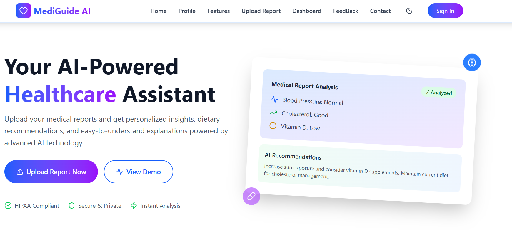
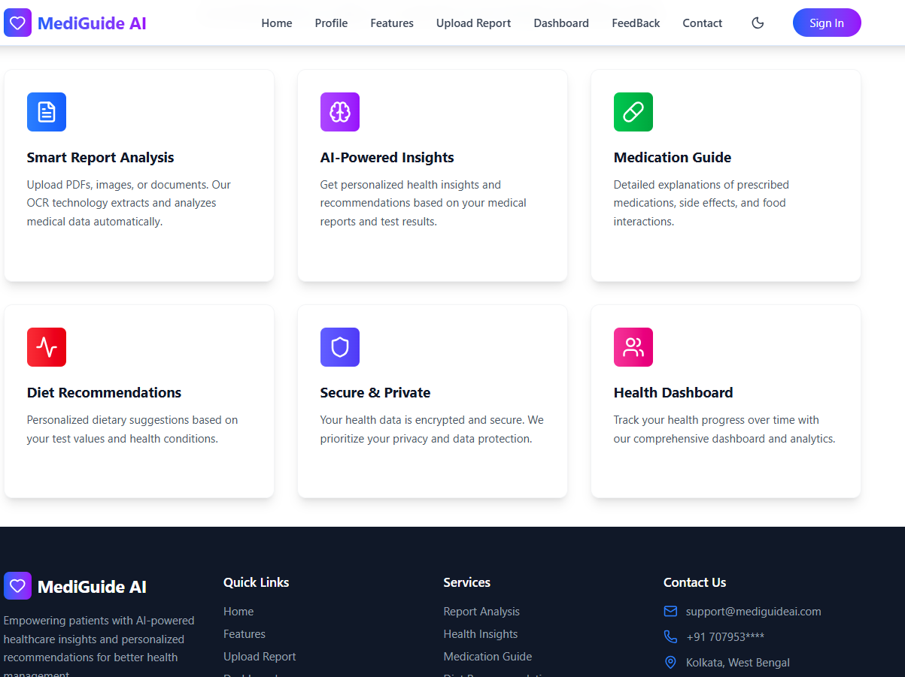

# MediGuide AI Frontend 🌐
### AI-Powered Healthcare Assistant - User Interface

[](https://reactjs.org/)
[](https://vitejs.dev/)
[](https://developer.mozilla.org/en-US/docs/Web/JavaScript)

[](https://tailwindcss.com/)
[](https://vercel.com)
[](https://cura-genie-zeta.vercel.app)

## 🚀 Live Demo
**🔗 [https://cura-genie-zeta.vercel.app](https://cura-genie-zeta.vercel.app)**


## 🔍 Overview

The MediGuide AI Frontend is a modern, responsive web application built with React and Vite that provides an intuitive interface for users to interact with our AI-powered healthcare assistant. Deployed on Vercel, it offers seamless report uploading, real-time AI analysis, and personalized health insights.

This frontend communicates with the [MediGuide AI Backend](https://github.com/yourusername/CuraGenie_backend) to deliver a complete healthcare management experience.

## ✨ Features

### 🎨 User Interface
- **📱 Responsive Design**: Mobile-first approach with seamless desktop experience
- **🎯 Intuitive UX**: Clean, medical-grade interface design
- **🌙 Dark/Light Mode**: Toggle between themes for user comfort
- **♿ Accessibility**: WCAG 2.1 compliant with screen reader support

### 🔧 Core Functionality
- **📄 Drag & Drop Upload**: Easy medical report upload with progress indicators
- **📊 Real-time Analysis**: Live processing status and instant results
- **📈 Interactive Dashboard**: Comprehensive health insights visualization
- **💬 AI Chat Interface**: Conversational health assistant(upcoming)
- **📱 Progressive Web App**: Installable mobile experience
- **🔔 Smart Notifications**: Real-time updates and health reminders

## 🛠 Technology Stack

### Frontend Framework
- **React 18+** - Component-based UI library with Hooks
- **Vite 5+** - Next-generation build tool and dev server
- **JavaScript ES6+** - Modern JavaScript features

### Styling & UI
- **Tailwind CSS 3+** - Utility-first CSS framework
- **CSS3** - Custom styles and animations
- **Responsive Design** - Mobile-first approach

### State Management & Data
- **React Context API** - Built-in state management
- **React Hooks** - useState, useEffect, useContext
- **Native Fetch API** - Modern HTTP client for API communication

### Development Tools
- **ESLint** - Code linting and formatting
- **PostCSS** - CSS processing with Tailwind
- **Vite Dev Server** - Fast development with HMR

## 📁 Project Structure

```
MediGuide-AI_Frontend/
├── public/                 # Static assets
│   ├── favicon/           # Favicon files
│   └── images/            # Public images
├── src/                   # Source code
│   ├── components/        # Reusable React components
│   │   ├── Navbar/           # Navbar components
│   │   ├── Footer/        # Footer components
│   │   └── loading/       # Loading components
│   ├── pages/            # Page components
│   │   ├── Dashboard/    # Dashboard page
│   │   ├── Upload/       # Upload page
│   │   └── Reports/      # Reports page
│   ├── hooks/            # Custom React hooks
│   ├── services/         # API service functions
│   ├── context/          # React Context providers
│   ├── utils/            # Utility functions
│   ├── styles/           # Global CSS styles
│   └── App.jsx           # Main App component
├── .eslintrc.json        # ESLint configuration
├── vite.config.js        # Vite configuration
├── package.json          # Dependencies and scripts
├── postcss.config.js     # PostCSS configuration
├── tailwind.config.js    # Tailwind CSS configuration
└── index.html            # HTML entry point
```

## 🚀 Installation

### Prerequisites
- Node.js 16.0 or higher
- npm or yarn package manager
- Git

### Local Development Setup

1. **Clone the repository**
   ```bash
   git clone https://github.com/yourusername/MediGuide-AI_Frontend.git
   cd MediGuide-AI_Frontend
   ```

2. **Install dependencies**
   ```bash
   npm install
   # or
   yarn install
   ```

3. **Set up environment variables**
   ```bash
   cp .env.example .env
   # Edit .env with your configuration
   ```

4. **Start development server**
   ```bash
   npm run dev
   # or
   yarn dev
   ```

5. **Open your browser**
   ```
   http://localhost:5173
   ```

## 💻 Usage

### Development Commands

```bash
# Start development server (with HMR)
npm run dev

# Build for production
npm run build

# Preview production build
npm run preview

# Run linting
npm run lint

# Fix linting issues
npm run lint:fix
```

### Key User Flows

1. **Report Upload**
   - Navigate to upload page
   - Drag & drop or select medical report
   - Monitor real-time processing
   - View AI-generated insights

2. **Health Dashboard**
   - Access comprehensive health overview
   - Track historical reports
   - View personalized recommendations
   - Monitor health trends

3. **AI Chat Assistant**
   - Ask health-related questions
   - Get instant AI responses
   - Receive personalized advice
   - Access 24/7 support

## 🌐 Deployment

### Vercel Deployment (Current)

The application is automatically deployed to Vercel:

- **Production URL**: [https://cura-genie-zeta.vercel.app](https://cura-genie-zeta.vercel.app)
- **Auto-deployment**: Triggered on every push to `main` branch
- **Preview deployments**: Available for all pull requests

### Manual Deployment to Vercel

1. **Install Vercel CLI**
   ```bash
   npm i -g vercel
   ```

2. **Build and Deploy**
   ```bash
   npm run build
   vercel --prod
   ```

### Alternative Deployment Options

```bash
# Deploy to Netlify
npm run build && netlify deploy --prod --dir=dist

# Deploy to GitHub Pages
npm run build
# Upload dist folder to GitHub Pages

# Serve locally
npm run preview
```

## ⚙️ Environment Variables

Create a `.env` file in the root directory:

```env
# App Configuration
VITE_APP_NAME=MediGuide AI
VITE_APP_VERSION=1.0.0

# API Configuration
VITE_API_URL=https://your-backend-api.com
VITE_API_VERSION=v1

# Feature Flags
VITE_ENABLE_CHAT=true
VITE_ENABLE_NOTIFICATIONS=true
VITE_ENABLE_DARK_MODE=true

# External Services (Optional)
VITE_GOOGLE_ANALYTICS_ID=GA_MEASUREMENT_ID
```

## 🔌 API Integration

### Backend Connection with Fetch API

The frontend connects to the Flask backend using native fetch:

```javascript
// src/services/api.js
const API_BASE_URL = import.meta.env.VITE_API_URL || 'http://localhost:5000';

// Upload medical report
export const uploadReport = async (file) => {
  const formData = new FormData();
  formData.append('report', file);
  
  try {
    const response = await fetch(`${API_BASE_URL}/api/upload`, {
      method: 'POST',
      body: formData,
    });
    
    if (!response.ok) {
      throw new Error(`HTTP error! status: ${response.status}`);
    }
    
    return await response.json();
  } catch (error) {
    console.error('Upload failed:', error);
    throw error;
  }
};

// Get analysis results
export const getAnalysis = async (reportId) => {
  try {
    const response = await fetch(`${API_BASE_URL}/api/analysis/${reportId}`, {
      method: 'GET',
      headers: {
        'Content-Type': 'application/json',
      },
    });
    
    if (!response.ok) {
      throw new Error(`HTTP error! status: ${response.status}`);
    }
    
    return await response.json();
  } catch (error) {
    console.error('Failed to get analysis:', error);
    throw error;
  }
};

// Get user reports
export const getUserReports = async () => {
  try {
    const response = await fetch(`${API_BASE_URL}/api/reports`, {
      method: 'GET',
      headers: {
        'Content-Type': 'application/json',
        'Authorization': `Bearer ${localStorage.getItem('token')}`,
      },
    });
    
    return await response.json();
  } catch (error) {
    console.error('Failed to get reports:', error);
    throw error;
  }
};
```

### Custom Hooks for API Integration

```javascript
// src/hooks/useApi.js
import { useState, useEffect } from 'react';

export const useUpload = () => {
  const [uploading, setUploading] = useState(false);
  const [progress, setProgress] = useState(0);
  const [error, setError] = useState(null);

  const upload = async (file) => {
    setUploading(true);
    setError(null);
    setProgress(0);

    try {
      const formData = new FormData();
      formData.append('report', file);

      const response = await fetch('/api/upload', {
        method: 'POST',
        body: formData,
      });

      if (!response.ok) {
        throw new Error('Upload failed');
      }

      setProgress(100);
      const result = await response.json();
      return result;
    } catch (err) {
      setError(err.message);
      throw err;
    } finally {
      setUploading(false);
    }
  };

  return { upload, uploading, progress, error };
};

// src/hooks/useReports.js
export const useReports = () => {
  const [reports, setReports] = useState([]);
  const [loading, setLoading] = useState(true);
  const [error, setError] = useState(null);

  const fetchReports = async () => {
    try {
      const response = await fetch('/api/reports');
      const data = await response.json();
      setReports(data);
    } catch (err) {
      setError(err.message);
    } finally {
      setLoading(false);
    }
  };

  useEffect(() => {
    fetchReports();
  }, []);

  return { reports, loading, error, refetch: fetchReports };
};
```

## 📊 Performance

### Vite Optimization Features
- **⚡ Lightning Fast HMR**: Instant hot module replacement
- **📦 Optimized Builds**: Tree shaking and code splitting
- **🗜️ Asset Optimization**: Automatic image and CSS optimization
- **⚡ Fast Refresh**: React Fast Refresh integration

### Performance Metrics
- **Lighthouse Score**: 95+ across all metrics
- **First Contentful Paint**: < 1.2s
- **Largest Contentful Paint**: < 2.0s
- **Time to Interactive**: < 2.5s
- **Bundle Size**: < 200KB gzipped


## 🧪 Testing

```bash
# Install testing dependencies
npm install --save-dev vitest @testing-library/react @testing-library/jest-dom

# Run tests
npm run test

# Run tests in watch mode
npm run test:watch

# Generate coverage report
npm run test:coverage
```

## 🤝 Contributing

We welcome contributions! Please follow these steps:

1. **Fork the repository**
2. **Create feature branch** (`git checkout -b feature/NewFeature`)
3. **Commit changes** (`git commit -m 'Add NewFeature'`)
4. **Push to branch** (`git push origin feature/NewFeature`)
5. **Open Pull Request**

### Development Guidelines
- Follow JavaScript ES6+ best practices
- Use functional components with hooks
- Maintain responsive design principles
- Write clean, readable code with proper comments
- Test new features thoroughly
- Follow the existing code style and conventions

## 🔄 Related Repositories

- **Backend API**: [CuraGenie_backend](https://curagenie-backend.onrender.com)
- **Mobile App**: [MediGuide-Mobile](#) _(Coming Soon)_


## 📈 Roadmap

### Upcoming Features
- [ ] **PWA Enhancement** - Full offline functionality
- [ ] **Advanced Charts** - Interactive health data visualization
- [ ] **Voice Interface** - Speech-to-text for accessibility
- [ ] **Multi-language Support** - Internationalization
- [ ] **Real-time Chat** - WebSocket-based chat system

### Technical Improvements
- [ ] **Component Library** - Reusable UI component system
- [ ] **State Management** - Zustand or Redux integration
- [ ] **Testing Suite** - Comprehensive test coverage
- [ ] **Performance Monitoring** - Web vitals tracking


## 👨‍💻 Author

**Your Name**
- GitHub: [@Agyanshu7352](https://github.com/Agyanshu7352/MediGuide-AI_Frontend.git)
 - LinkedIn: [Agyanshu Kumar](www.linkedin.com/in/agyanshukumar)
- Email: agyanshukumar@gmail.com
- Portfolio: [Portfolio](https://agyanshu7352.github.io/My_portfolio/)

## 🙏 Acknowledgments

- React team for the amazing library
- Vite team for the blazing-fast build tool
- Tailwind CSS for the utility-first CSS framework
- Vercel for seamless deployment
- Open-source community for invaluable tools
- Medical professionals for domain expertise


<div align="center">
  <p><strong>🩺 Democratizing Healthcare Through Technology</strong></p>
  <p>⭐ If this project helps you, please give it a star!</p>
  
  [](https://vercel.com/new/clone?repository-url=https://github.com/yourusername/MediGuide-AI_Frontend)
</div>